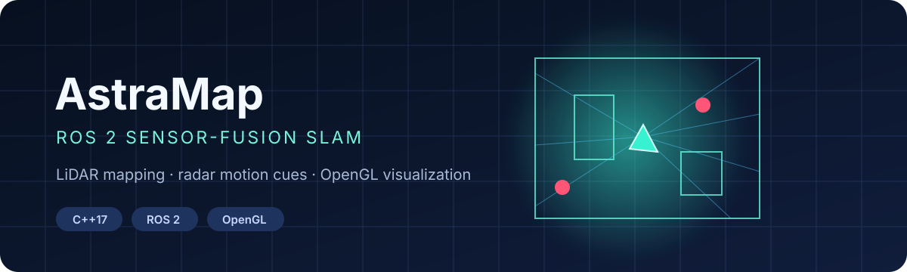
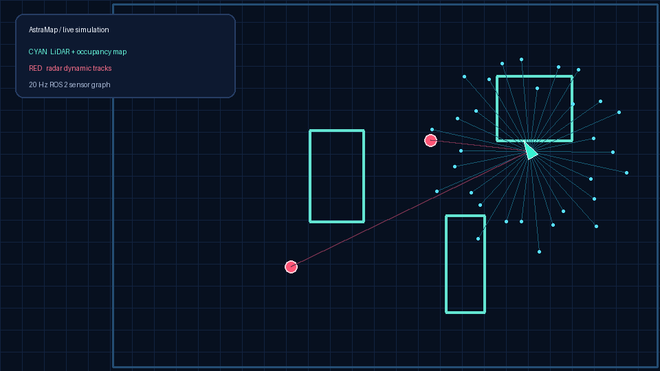
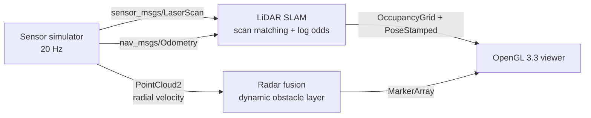
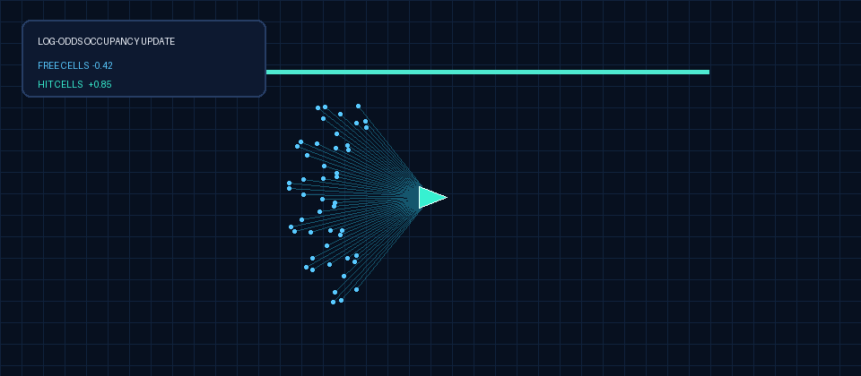

<p align="center">
  
</p>

<p align="center">
  <a href="https://github.com/mneha05/astramap-ros2/actions/workflows/ci.yml"></a>
  
  
  
  <a href="https://astramap-live.maheshneha34.chatgpt.site"></a>
</p>

**AstraMap** is a compact autonomous-robot perception stack built in modern C++. It generates synchronized LiDAR, radar, and wheel-odometry streams; corrects odometry drift with correlative scan matching; builds a probabilistic 2D occupancy map; and renders the result in a custom OpenGL viewer.

The demo is self-contained—no bag files or physical sensors required—while keeping standard ROS 2 message boundaries so simulated inputs can be replaced with real hardware drivers.

<p align="center"><strong><a href="https://astramap-live.maheshneha34.chatgpt.site">Launch the interactive WebGL simulation →</a></strong><br><sub>Pause the ROS graph, change speed, toggle sensors, and click the map to place obstacles.</sub></p>

<p align="center">
  
</p>

## Why this project is interesting

- **ROS 2 graph, not a monolith:** independent simulator, SLAM, and visualization nodes communicate through standard topics and QoS profiles.
- **Actual mapping logic:** Bresenham ray tracing updates a bounded log-odds occupancy grid rather than painting scan points onto an image.
- **Pose correction:** a correlative scan matcher searches around the wheel-odometry prediction and scores transformed LiDAR endpoints against the current map.
- **Complementary sensors:** LiDAR shapes static geometry; radar contributes moving-object detections and radial-velocity cues.
- **Custom GPU visualization:** an OpenGL 3.3 core-profile renderer uses GLSL shaders, VAOs, and streaming VBOs for the map, scan returns, radar tracks, and robot pose.
- **Reproducible engineering:** Docker, ROS launch/config files, deterministic simulation, unit tests, and GitHub Actions are included.

## System design



### ROS interfaces

| Topic | Type | Producer | Purpose |
|---|---|---|---|
| `/scan` | `sensor_msgs/LaserScan` | simulator / real LiDAR driver | 360° range returns |
| `/wheel/odometry` | `nav_msgs/Odometry` | simulator / robot base | motion prediction |
| `/radar/detections` | `sensor_msgs/PointCloud2` | simulator / radar driver | xyz, intensity, radial velocity |
| `/map` | `nav_msgs/OccupancyGrid` | SLAM node | probabilistic 2D map |
| `/slam/pose` | `geometry_msgs/PoseStamped` | SLAM node | corrected robot pose |
| `/fusion/dynamic_obstacles` | `visualization_msgs/MarkerArray` | fusion node | radar-derived moving targets |

## Run it

### Native ROS 2 Humble

```bash
sudo apt install ros-humble-desktop libglfw3-dev libglew-dev libgl1-mesa-dev

mkdir -p ~/astramap_ws/src
cd ~/astramap_ws/src
git clone https://github.com/mneha05/astramap-ros2.git astra_slam
cd ..

source /opt/ros/humble/setup.bash
rosdep install --from-paths src --ignore-src -r -y
colcon build --symlink-install
source install/setup.bash
ros2 launch astra_slam demo.launch.py
```

Run the graph without a display (useful over SSH or in CI):

```bash
ros2 launch astra_slam demo.launch.py viewer:=false
```

### Docker

```bash
xhost +local:docker
docker compose up --build
```

The compose file passes through X11 and `/dev/dri` so the OpenGL renderer can use host GPU acceleration on Linux.

## Algorithms

<p align="center">
  
</p>

### 1. LiDAR inverse sensor model

For every beam, Bresenham traversal marks cells between the robot and the return as free and marks the endpoint occupied. Evidence accumulates in log-odds form and is clamped to prevent numerical saturation:

$$L_t(m_i)=\operatorname{clamp}\left(L_{t-1}(m_i)+\ell(z_t,m_i), -4, 4\right)$$

### 2. Correlative scan matching

Wheel odometry predicts the next pose. AstraMap samples a bounded $(x,y,\theta)$ neighborhood and chooses the candidate whose transformed scan endpoints align best with occupied map cells. The search is deliberately readable and deterministic—a strong baseline before branch-and-bound, ICP, or Ceres-based optimization.

### 3. Radar motion layer

Radar detections use `PointCloud2` fields for `x`, `y`, `z`, return intensity, and radial velocity. Detections are transformed from `base_link` into the SLAM map frame and published as short-lived dynamic markers; color encodes speed magnitude.

### 4. OpenGL rendering

The viewer maintains separate vertex streams for occupied cells, live LiDAR hits, radar targets, and robot geometry. A minimal GLSL pipeline keeps ROS message handling independent of rendering and makes it easy to add trails, uncertainty ellipses, or cost-map layers.

## Use real sensors

The SLAM node only depends on ROS messages. To move from simulation to hardware:

1. Disable `sensor_sim_node` in `launch/demo.launch.py`.
2. Remap your LiDAR driver's scan topic to `/scan`.
3. Publish base odometry on `/wheel/odometry`.
4. Convert radar detections to the documented `PointCloud2` fields and publish `/radar/detections`.
5. Calibrate sensor extrinsics and publish the appropriate TF transforms for a production robot.

The included demo assumes sensors are co-located at `base_link`; it is a portfolio-scale SLAM front end, not a safety-certified autonomy stack.

## Repository map

```text
astra_slam/
├── include/astra_slam/       # reusable mapping and scan-matching core
├── src/
│   ├── sensor_sim_node.cpp   # LiDAR, radar, odometry, TF
│   ├── fusion_slam_node.cpp  # scan matching, occupancy map, radar layer
│   └── opengl_viewer_node.cpp# GLSL/OpenGL renderer
├── launch/ + config/         # one-command ROS 2 demo
├── test/                     # deterministic mapping/matcher tests
├── Dockerfile                # ROS 2 Humble environment
└── .github/workflows/        # build + test on every push
```

## Test

```bash
colcon test --packages-select astra_slam
colcon test-result --verbose
```

The tests cover coordinate conversion behavior, free/occupied ray updates, ROS-compatible unknown-cell export, and scan-matcher pose correction.

## Next steps

- Add TF-based sensor extrinsics and timestamp synchronization with `message_filters`.
- Replace exhaustive correlative search with a multi-resolution branch-and-bound pyramid.
- Track radar targets across frames with an EKF and data association.
- Evaluate pose error and map IoU against recorded ROS bags.

---

Built by [Neha Mahesh](https://github.com/mneha05) as a focused exploration of robotics perception, ROS 2 systems, SLAM, sensor fusion, and graphics programming.
